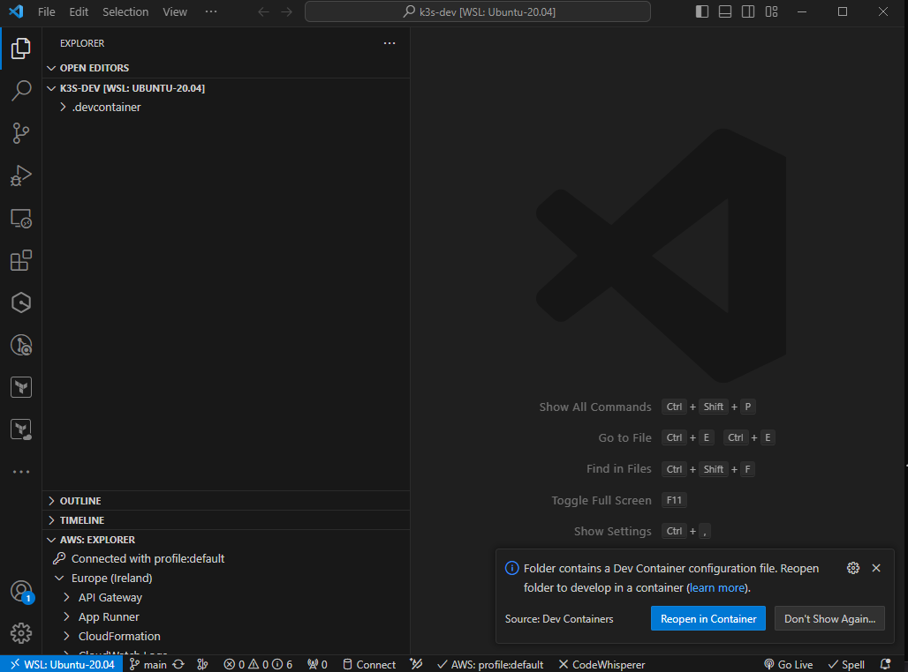

# vscode-devcontainer
This vscode devcontainer provides an all in one developer environment for kubernetes 

- https://github.com/mikefarah/yq
- https://github.com/helm/helm
- https://github.com/kubernetes-sigs/kustomize
- https://kubernetes.io/docs/tasks/tools
- https://github.com/derailed/k9s
- https://github.com/bitnami-labs/sealed-secrets
- https://github.com/kubernetes-sigs/cluster-api
- https://github.com/argoproj/argo-cd
- https://github.com/cilium/cilium-cli
- https://github.com/patrickdappollonio/kubectl-slice
- https://gitlab.com/gitlab-org/cli
- https://github.com/tellerops/teller
- https://github.com/charmbracelet/gum
- https://github.com/argoproj/argo-rollouts
- https://github.com/kyverno/kyverno
- https://github.com/k3d-io/k3d

## Requirements
- VScode with the [dev container extension installed](vscode:extension/ms-vscode-remote.remote-containers)
- Docker


## Getting started

Create a directory and clone this repo into it

```sh
mkdir k3s-dev
cd k3s-dev
git clone git@github.com:x00205790/EADesign_lab.git .devcontainer
code .
```

This will open VSCode in your newly created directory and you will be prompted to `Reopen in Container`



## Running the K3D Cluster
The devcontainer can be use to spawn a single node k3s instance using [K3D](https://k3d.io/)

Running `k3s-tools` will prompt you to create or delete a dev cluster. Once running you can connect to it with kubectl or k9s.

